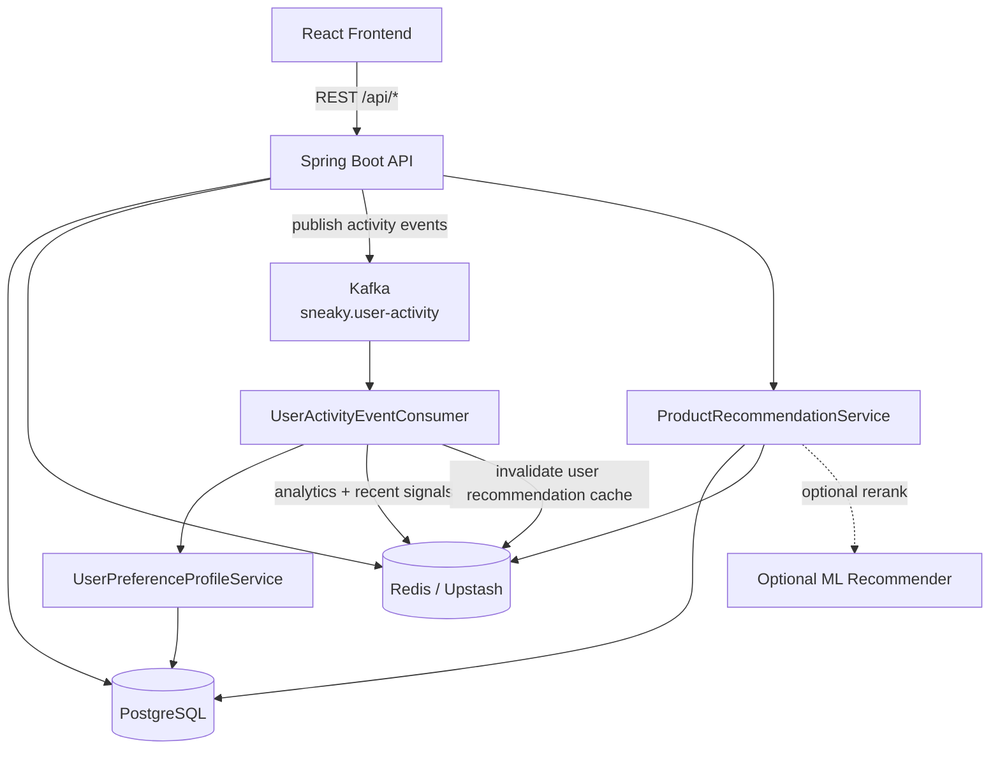
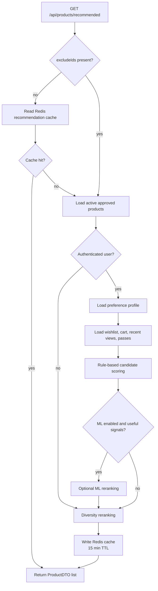
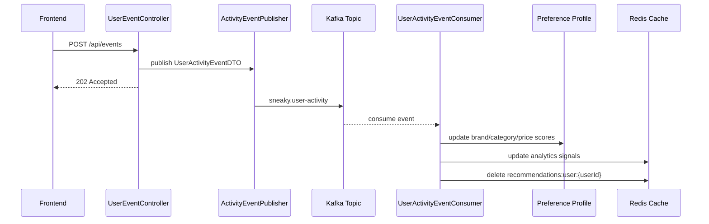
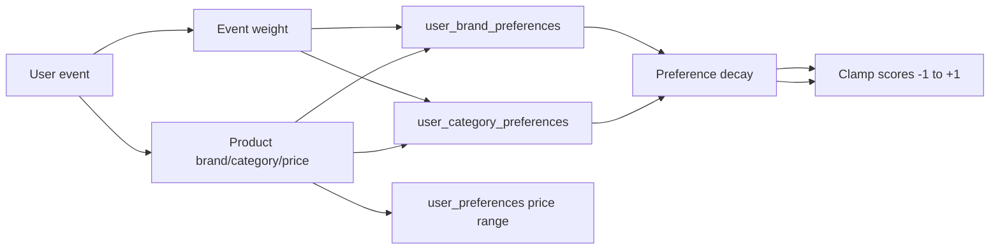

# Sneaky System Architecture

This document summarizes the backend architecture added for behavioral events, preference learning, Redis recommendation caching, and hybrid recommendations.

## Architecture Snapshot

## Recommendation Flow

## Event Tracking Flow

## User Preference Learning

Supported event types:

| Event | Weight |
| --- | ---: |
| `IMPRESSION` | 0.0 |
| `VIEW` | 0.5 |
| `CLICK` | 1.0 |
| `SKIP` | -1.0 |
| `WISHLIST` | 3.0 |
| `CART` | 4.0 |
| `PURCHASE` | 5.0 |

Preference decay keeps old behavior from dominating forever:

| Signal Age | Effective Weight |
| --- | ---: |
| Less than 7 days | 100% |
| 7-30 days | 80% |
| 30-90 days | 60% |
| 90+ days | 30% |

## Redis Usage

| Key / Area | Purpose | TTL |
| --- | --- | ---: |
| `recommendations:guest` | Guest feed ranked product IDs | 15 min |
| `recommendations:user:{userId}` | Personalized ranked product IDs | 15 min |
| `recommendations:user:{userId}:personalized` | Cache metadata flag | 15 min |
| Product analytics keys | Views, passes, popularity, recent signals | Feature-specific |
| Rate limit keys | API/session refresh throttling | Short window |
| Logout token keys | JWT invalidation support | Token lifetime |

## Why This Matters

| Architecture Change | Impact |
| --- | --- |
| Event API returns `202 Accepted` | User actions do not wait for recommendation processing |
| Kafka consumer updates preferences asynchronously | Behavior learning is decoupled from request latency |
| Redis cache-aside recommendation feed | Repeated feed opens avoid expensive ranking work |
| Event-driven cache invalidation | Wishlist/cart/purchase/preference updates refresh future recommendations |
| Hybrid recommendation engine | Rule-based fallback remains reliable while ML reranking can improve personalization |
| Preference decay | Old user behavior naturally loses influence over time |
